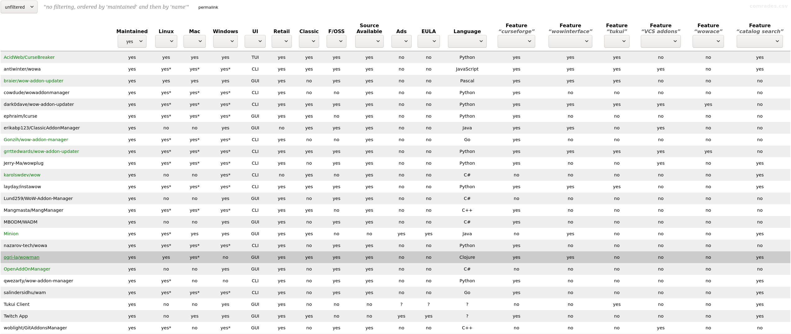

# wowman-comrades

A [website](https://ogri-la.github.io/wow-addon-managers/) for wowman's 
[comrades.csv](https://github.com/ogri-la/wowman/blob/develop/comrades.csv) file.

 

## Local development

To get an interactive development environment run:

    lein figwheel

and open your browser at [localhost:3449](http://localhost:3449/).
This will auto compile and send all changes to the browser without the
need to reload.

To clean all compiled files:

    lein clean

To create a production build run:

    lein do clean, cljsbuild once min

And open your browser in `resources/public/index.html`. You will not
get live reloading, nor a REPL. 

## License

Copyright © 2019-2020 Torkus

Distributed under the GNU Affero General Public Licence, version 3 [with additional permissions](LICENCE.txt#L665)
