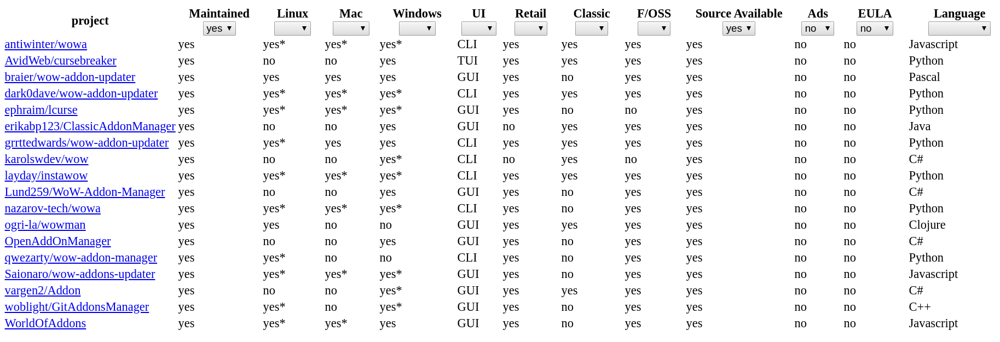

# wowman-comrades

A web interface for [wowman's](https://github.com/ogri-la/wowman) 
[comrades.csv](https://github.com/ogri-la/wowman/blob/develop/comrades.csv) file, 
[available here](https://ogri-la.github.io/wow-addon-managers/)

 

## Overview

The `comrades.csv` file I maintain has gotten large and difficult to simply follow.

I'd like to point people at a site and have it mostly pre-filtered for them, with the opportunity to explore further if
they wish.

I'd also like a bit more distance/transparency/neutrality between wowman and visitors to this list.

## Local development

To get an interactive development environment run:

    lein figwheel

and open your browser at [localhost:3449](http://localhost:3449/).
This will auto compile and send all changes to the browser without the
need to reload.

To clean all compiled files:

    lein clean

To create a production build run:

    lein do clean, cljsbuild once min

And open your browser in `resources/public/index.html`. You will not
get live reloading, nor a REPL. 

## License

Copyright © 2019 Torkus

Distributed under the Eclipse Public License either version 1.0 or (at your option) any later version.
